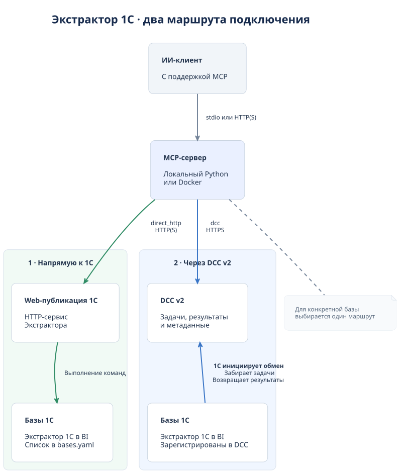

# MCP Экстрактора 1С — установка и настройка, версия 3.2.0

**Разработчик — Денвик Аналитика, ООО.**

- Сайт: [bi.denvic.ru](https://bi.denvic.ru/).
- Документация: [Экстрактор 1С в BI](https://docs.denvic.tech/extractor_docs/extractor_docs/).

MCP позволяет ИИ-клиенту читать метаданные 1С, создавать и проверять проекты Экстрактора, управлять расписаниями, инициализацией и выгрузкой. Для работы нужен **Экстрактор 1С в BI, версии не ниже 3.16.1.3**. Версия MCP-сервера — **3.2.0**. Сервер находится в `mcp/`; методы 1С сопровождаются в коммерческой поставке [«Экстрактор данных 1С в BI»](https://bi.denvic.ru/).

[Репозиторий MCP](https://github.com/Denvic-Tech/extractor-mcp-server). Установка выполняется из ветки **`main`** или согласованного релиза.

## 1. Схема развертывания и выбор маршрута



[Исходник PlantUML](docs/diagrams/mcp-deployment.puml).

| Режим | Движение команд | Перечень баз |
|---|---|---|
| `direct_http`, по умолчанию | ИИ → MCP → HTTP-публикация 1С | Одна или несколько баз в `bases.yaml` |
| `dcc` | ИИ → MCP → DCC v2; 1С опрашивает DCC и отправляет результаты | Все доступные пользователю DCC совместимые коннекторы |

Это маршрут **MCP → базы**. Отдельно выбирается транспорт **ИИ → MCP**: локальный `stdio` либо `streamable-http` с адресом `/mcp`.

## 2. Что подготовить перед установкой

1. Установленный и лицензированный **Экстрактор 1С в BI, версии не ниже 3.16.1.3**, в каждой базе. Обновление Python-сервера не обновляет Экстрактор в 1С.
2. Учётную запись с правами на методы и данные 1С; для DCC — учётную запись с доступом к нужным коннекторам.
3. DNS и сетевой доступ с машины/контейнера MCP к публикациям 1С или DCC, HTTP(S)-порты, доверенные сертификаты. Проверять нужно и из контейнера.
4. Машину для MCP, Git и Python либо Docker с Compose; при первой установке доступ к репозиторию, PyPI и, для Docker, реестру образов.
5. ИИ-клиент с поддержкой выбранного MCP-транспорта. Для HTTP нужен Bearer-токен MCP, отличный от пароля 1С и пароля DCC.
6. Закрытое место для `.env`, `bases.yaml`, сертификатов и постоянной SQLite-истории операций.

### Без DCC: обязательная web-публикация 1С

Для `direct_http` каждая база должна быть опубликована на web-сервере, поддерживаемом вашей платформой 1С. Установите web-компоненты **той же версии платформы**, которая обслуживает базу, и настройте публикацию через Конфигуратор/администратора web-сервера.

Обязательно:

- Установить или встроить Экстрактор с HTTP-сервисом `extractor-projects` и актуальным модулем `EPA_Projects`.
- Разрешить публикацию HTTP-сервисов и включить `extractor-projects`.
- При установке расширением включить **флаг публикации HTTP-сервисов расширений** (в интерфейсах платформы — «Публиковать HTTP-сервисы расширений по умолчанию» или аналогичный параметр). Проверить, что сервис нужного расширения действительно включён в публикацию. Самого наличия расширения в базе недостаточно.
- Настроить аутентификацию выделенным пользователем 1С. Клиент использует логин/пароль; автоматический Windows-вход текущего пользователя их не заменяет.
- После обновления сервиса/расширения обновить публикацию и проверить обработчики.

Адрес API: `https://1c.example.ru/erp/hs/extractor-projects/v1`. Адрес web-клиента `https://1c.example.ru/erp` в `bases.yaml` не подходит. Платформа 1С на самой машине MCP не требуется.

Разработка методов предусматривает платформу 8.3.5 и режим совместимости 8.2 при встраивании в конфигурацию. Это не означает наличия HTTP-сервисов на самой платформе 8.2: проверяйте фактически используемую платформу и компиляцию. Расширение и встраивание — разные способы установки 1С-части; Python-установщик их не выполняет.

### Через DCC v2

Нужны DCC v2 с реализованным контрактом MCP-операций и Экстрактор с обработчиком этих задач. Зарегистрируйте базы в DCC v2, настройте обмен в 1С и регламентное задание опроса, выгрузите метаданные. Коннекторы должны объявлять `client_contract=extractor-1c/2.0` и команду `mcp` в `supported_commands`.

MCP получает все такие коннекторы, доступные его пользователю, включая временно offline. Web-публикация 1С в этом маршруте не нужна. **Общение с DCC инициирует 1С**. Само наличие версии «v2» не подтверждает реализацию MCP-задач и структурированных результатов; проверяйте `list_bases` и `readiness`.

## 3. Минимальные требования и компоненты

| Компонент | Требование |
|---|---|
| Локальный Python / установщик | **Python 3.11+**, `venv`, `pip`; Docker-образ использует Python 3.13 |
| ОС без Docker | Windows или Unix-система с указанным Python и зависимостями |
| Docker | Engine + Compose v2 на Linux; Docker Desktop с **Linux-контейнерами** на поддерживаемой Windows/macOS |
| Python-зависимости | `mcp>=1.29,<2`, FastAPI, Uvicorn, Pydantic 2, pydantic-settings, requests, PyYAML; ставятся автоматически |
| Тесты разработчика | Группа `.[dev]`: pytest, httpx |
| Диск и права | Чтение закрытых настроек и запись постоянного каталога SQLite |
| 1С | Экстрактор 1С в BI, версии не ниже 3.16.1.3, лицензия и права пользователя |

Ориентир для небольшого отдельного сервера MCP: **1 vCPU, 1 ГБ RAM, 2 ГБ свободного диска** плюс место для Docker/сборок/резервных копий. Это оценка для планирования, а не измеренный аппаратный минимум. Требования Docker Desktop/WSL и базы 1С учитываются отдельно. MCP управляет выгрузкой; её объём не равен расходу памяти MCP.

Устанавливайте Docker по официальным инструкциям: [Docker Engine](https://docs.docker.com/engine/install/), [Compose](https://docs.docker.com/compose/install/), [Docker Desktop для Windows](https://docs.docker.com/desktop/setup/install/windows-install/) и [WSL 2](https://docs.docker.com/desktop/features/wsl/). Windows должна соответствовать актуальным требованиям Docker Desktop, включая виртуализацию. Для Unix-платформ без Docker Engine используйте Linux-машину/VM или локальный Python.

## 4. Пошаговый установщик

Получите исходники:

```text
git clone https://github.com/Denvic-Tech/extractor-mcp-server.git
cd extractor-mcp-server
git switch main
cd mcp
```

Все последующие команды выполняются **из `mcp/`**. Установщик использует стандартную библиотеку Python и не требует предварительной установки PyYAML.

Windows PowerShell:

```powershell
py -3 --version
py -3 scripts/install.py
```

Linux/macOS:

```bash
python3 --version
python3 scripts/install.py
```

Установщик спрашивает:

1. Запускать в Docker? По умолчанию **нет**, локальный Python.
2. Использовать DCC v2? По умолчанию **нет**, одна база 1С.
3. Для прямого подключения: ID/название базы, полный URL API, логин и пароль. Для DCC: URL и учётные данные DCC; список баз поступит из DCC.
4. Для HTTP — подтвердить доверенную тестовую сеть. Для эксплуатации используйте HTTPS.
5. Установить зависимости в `.venv` либо собрать/запустить контейнер сейчас?

Пароль вводится скрыто. Создаются `.env`, `bases.yaml` и случайный MCP-токен без вывода секретов. `bases.yaml` генерируется в JSON-нотации — это корректный YAML, пригодный для ручного редактирования. В DCC-режиме список пустой и не читается маршрутом, но файл нужен Docker mount.

Существующая `.env` или `bases.yaml` **не заменяется**. Для перенастройки: `--overwrite` сохраняет оригиналы в `.local-backups/installer-...` в корне репозитория. `--configure-only` создаёт только настройки. Пароли с переносами строк или `${...}` не записываются установщиком в `.env`; используйте окружение процесса/менеджер секретов для таких значений.

Установщик не устанавливает Docker/1С/расширение, не создаёт web-публикацию или проекты, не регистрирует базу в DCC и не создаёт службу ОС. На Unix новые закрытые файлы имеют права `600`; на Windows ограничьте NTFS-права владельцем и учётной записью службы. Существующую `.venv` перед переустановкой пакетов также оцените как рабочее окружение.

## 5. Настройки `.env`

`.env` содержит параметры MCP и DCC, `bases.yaml` — перечень прямых баз 1С. **`.env.example` по-прежнему нужен**: его содержимое не заменено YAML. Рабочие файлы не добавляются в Git.

При ручной установке копируйте примеры только при отсутствии рабочих настроек:

```powershell
if (-not (Test-Path .env)) { Copy-Item .env.example .env }
if (-not (Test-Path bases.yaml)) { Copy-Item bases.example.yaml bases.yaml }
```

```bash
test -e .env || cp .env.example .env
test -e bases.yaml || cp bases.example.yaml bases.yaml
chmod 600 .env bases.yaml
```

Прямой маршрут:

```dotenv
EXTRACTOR_PROJECTS_TRANSPORT=direct_http
EXTRACTOR_PROJECTS_BASES_FILE=bases.yaml
EXTRACTOR_PROJECTS_DEFAULT_BASE_ID=erp
EXTRACTOR_PROJECTS_MCP_TOKENS=replace_with_a_random_secret
EXTRACTOR_PROJECTS_TIMEOUT=60
EXTRACTOR_PROJECTS_OPERATION_DB=state/operations.sqlite3
EXTRACTOR_PROJECTS_PLAN_TTL_SECONDS=900
```

Сгенерировать MCP-токен в закрытом терминале: `python -c "import secrets; print(secrets.token_urlsafe(32))"`. Передайте клиенту `Authorization: Bearer <токен>`; пример `replace_with_a_random_secret` рабочим токеном не является.

Маршрут DCC:

```dotenv
EXTRACTOR_PROJECTS_TRANSPORT=dcc
EXTRACTOR_PROJECTS_DCC_URL=https://dcc.example.ru
EXTRACTOR_PROJECTS_DCC_USER=mcp
EXTRACTOR_PROJECTS_DCC_PASSWORD='replace_with_dcc_password'
EXTRACTOR_PROJECTS_DCC_WAIT_TIMEOUT=60
EXTRACTOR_PROJECTS_DCC_POLL_INTERVAL=1
EXTRACTOR_PROJECTS_MCP_TOKENS=replace_with_a_random_secret
EXTRACTOR_PROJECTS_OPERATION_DB=state/operations.sqlite3
```

Для DCC уберите `BASES_FILE` из локального `.env`. Для универсального Docker Compose создайте `bases.yaml` с `bases: []`, если установщик его не создал. Compose задаёт контейнерный путь к файлу, но DCC-маршрут его не читает. `DCC_URL` — корень сервера с `/api` или без него, не `/docs`, не `/v2` и не публикация 1С.

Все параметры ниже имеют префикс **`EXTRACTOR_PROJECTS_`**:

| Имя после префикса | Назначение / значение по умолчанию |
|---|---|
| `TRANSPORT` | `direct_http` (по умолчанию) или `dcc` |
| `BASES_FILE` | YAML; относительный путь от рабочего каталога процесса |
| `DEFAULT_BASE_ID` | База по умолчанию; при нескольких базах без него нужен явный `base_id` |
| `MCP_TOKENS` | Один токен или список через запятую, допускается `label:token`; пусто блокирует HTTP, кроме `/health` |
| `TIMEOUT` | Таймаут исходящего HTTP-запроса, по умолчанию 60 с |
| `OPERATION_DB` | Постоянный путь SQLite-планов и ключей идемпотентности. Без настройки используется временный каталог ОС |
| `PLAN_TTL_SECONDS` | Действие preview-плана: 900 с по умолчанию, диапазон 60–86400 |
| `DCC_URL`, `DCC_USER`, `DCC_PASSWORD` | Адрес и учётные данные DCC; обязательны в `dcc`, пароль непустой |
| `DCC_WAIT_TIMEOUT` | Ожидание результата DCC-операции: 60 с, диапазон 0–3600 |
| `DCC_POLL_INTERVAL` | Проверка результата MCP → DCC: 1 с, больше 0 и не более 60. **Не интервал опроса DCC из 1С** |
| `ALLOW_HTTP_DEV` | По умолчанию `false`; разрешение HTTP/ослабление проверки TLS для разработки. Прямым базам предпочтительнее отдельное разрешение в YAML |
| `CA_BUNDLE` | PEM-набор доверенных CA для исходящих HTTPS-запросов |
| `CLIENT_CERT`, `CLIENT_KEY` | PEM-сертификат/ключ mTLS, задаются вместе |
| `ALLOWED_HOSTS` | Разрешённые Host внешнего MCP, через запятую; несовпадение даёт HTTP 421 |
| `URL`, `USER`, `PASSWORD` | Альтернативное прямое подключение одной базы без YAML |
| `BASES` | Альтернативный inline-JSON списка баз; нельзя одновременно с `BASES_FILE` |

Переменные окружения процесса имеют приоритет над `.env`. При установке из исходников сервер читает `mcp/.env`; запускайте из `mcp/`, чтобы относительные пути и HTTP-аутентификация читались согласованно. В Compose `.env` передаётся через `env_file`. Для службы используйте абсолютные пути или фиксированный рабочий каталог. После изменения настроек перезапустите сервер; в Docker пересоздайте контейнер через `up -d`. При локальном использовании `ALLOWED_HOSTS` экспортируйте его в окружение **до запуска**: защита Host создаётся при импорте.

## 6. Настройки `bases.yaml`

```yaml
bases:
  - base_id: erp
    name: ERP
    url: https://1c.example.ru/erp/hs/extractor-projects/v1
    user: mcp
    password: 'replace_with_1c_password'
    timeout: 60
    allow_http_dev: false
  - base_id: accounting
    name: Бухгалтерия
    url: https://1c.example.ru/accounting/hs/extractor-projects/v1
    user: mcp
    password: ''
```

| Поле | Назначение |
|---|---|
| `base_id` | Уникальный непустой ID, передаваемый MCP-методам |
| `name` | Название; при отсутствии отображается `base_id` |
| `url` | Полный API URL с окончанием `/hs/extractor-projects/v1` |
| `user`, `password` | Учётные данные публикации 1С; пустой пароль — `''`, не YAML `null` |
| `timeout` | Необязательный таймаут базы, перекрывает общий |
| `allow_http_dev` | Необязательное `true` для тестового HTTP; также ослабляет TLS-проверку этого клиента |
| `ca_bundle` | Необязательный PEM CA базы |
| `client_cert`, `client_key` | Необязательная пара файлов mTLS базы |

Единственный корневой ключ — `bases`; для `direct_http` список непустой. Повторные `base_id` и неизвестные поля отклоняются. Для второй базы добавьте запись и перезапустите сервер. ИИ вызывает `list_bases` и передаёт выбранный `base_id` во всех операциях.

В Docker пути сертификатов должны существовать **в контейнере**: добавьте read-only mount и укажите контейнерный путь, например `/run/extractor1c-certs/ca.pem`. `localhost` из контейнера — сам контейнер, не 1С и не хост. Для публикации на хосте Docker Desktop может использоваться `host.docker.internal`; для удалённой базы — её действительное DNS-имя.

## 7. Docker на Linux / Unix

Установите Engine и Compose по официальным ссылкам выше. На macOS используйте Docker Desktop с Linux-контейнерами. Проверка компонентов:

```bash
docker version
docker compose version
```

Получите репозиторий, перейдите в `mcp/`, подготовьте `.env`/`bases.yaml` вручную или установщиком. **Ручная Docker-установка Python на хосте не требует**; Python нужен только для интерактивного установщика.

```bash
docker compose -f docker-compose.install.yml config --quiet
docker compose -f docker-compose.install.yml up -d --build
docker compose -f docker-compose.install.yml ps
curl --fail http://127.0.0.1:8001/health
```

Универсальный `docker-compose.install.yml` передаёт `.env`, монтирует YAML только для чтения и сохраняет SQLite в named volume `extractor1c_state`. Путь `OPERATION_DB` принудительно установлен в `/var/lib/extractor1c/operations.sqlite3`, YAML — `/run/extractor1c/bases.yaml`. MCP: **`http://127.0.0.1:8001/mcp`**, только с этой машины; внутри контейнера порт 8000.

Остановка: `docker compose -f docker-compose.install.yml down`. После получения согласованных новых исходников обновление: повторить `up -d --build`. **Не используйте `down -v`**: удаление volume уничтожает планы и историю операций. Для резервной копии остановите приложение и сохраните весь volume, включая SQLite-файлы всех баз/пользователей.

Для удалённого клиента настройте HTTPS reverse proxy с поддержкой streamable HTTP и передачей Authorization. Адрес клиента: `https://mcp.example.ru/mcp`. Универсальный пример не публикует HTTP на все интерфейсы.

Существующие `docker-compose.yml`/`docker-compose.cloud.yml` предназначены для специализированных развёртываний с Caddy; их переменные и mounts для YAML/DCC адаптируются отдельно. Для новой установки используйте **`docker-compose.install.yml`**.

## 8. Docker на Windows

Установите/запустите Docker Desktop, выберите **Linux-контейнеры**, настройте WSL 2/виртуализацию по требованиям Docker. Из `mcp/`, после подготовки настроек:

```powershell
docker version
docker compose version
docker compose -f docker-compose.install.yml config --quiet
docker compose -f docker-compose.install.yml up -d --build
docker compose -f docker-compose.install.yml ps
Invoke-RestMethod -Uri http://127.0.0.1:8001/health
```

Проверьте доступ Docker Desktop к папке проекта и корпоративному DNS/сети. Windows-путь сертификата не является путём внутри Linux-контейнера. Остановка, обновление, volume и внешний HTTPS — как в Unix-разделе. Если Docker Desktop не подходит вашей редакции/сценарию Windows, используйте локальный Python или Linux VM с Engine.

## 9. Локально без Docker

### Windows PowerShell

Установите Python 3.11+ с `pip` и Git. Из `mcp/`:

```powershell
py -3 --version
py -3 -m venv .venv
.\.venv\Scripts\python.exe -m pip install -e .
# Подготовьте .env и bases.yaml по разделам выше.
.\.venv\Scripts\python.exe -m extractor1c.mcp_server
```

Активация `.venv` и изменение ExecutionPolicy не требуются. Проверка во втором терминале: `Invoke-RestMethod -Uri http://127.0.0.1:8001/health`.

### Linux / macOS

Подготовьте Python 3.11+, `pip`, `venv`. На Linux пакет `venv` может требовать отдельной установки для выбранной версии Python. Из `mcp/`:

```bash
python3 --version
python3 -m venv .venv
.venv/bin/python -m pip install -e .
# Подготовьте .env и bases.yaml по разделам выше.
.venv/bin/python -m extractor1c.mcp_server
```

Сервер слушает `127.0.0.1:8001`. Для другого порта: `.venv/bin/python -m uvicorn extractor1c.mcp_server:app --host 127.0.0.1 --port 8002`. У `extractor1c-mcp` нет собственных флагов `--host`/`--port`. Для внешнего подключения настройте HTTPS-прокси.

### Автозапуск

Для HTTP создайте службу ОС с абсолютным путём Python из `.venv`, аргументами `-m extractor1c.mcp_server`, рабочим каталогом `mcp/`, правами чтения настроек и записи постоянного `state/`. На Linux это может быть systemd, на Windows — служба или задание Планировщика при старте системы. Начинайте с одного процесса/worker, не запускайте две копии на одном порту. Для `stdio` процесс обычно запускает ИИ-клиент, отдельная HTTP-служба не нужна.

## 10. Подключение ИИ-клиента и инструкция агенту

**HTTP:** тип `streamable-http`, URL `http://127.0.0.1:8001/mcp` для локальной машины либо внешний HTTPS URL, заголовок `Authorization: Bearer <токен из .env>`. `/health` проверяет процесс, не соединение с базой и не заменяет `/mcp`.

**Stdio:** абсолютный Python из `.venv`, аргументы `-m extractor1c.mcp_server --transport stdio`, рабочий каталог `mcp/`. Для Windows Python: `.venv\Scripts\python.exe`; для Unix: `.venv/bin/python`. Если клиент не умеет задавать рабочий каталог, передайте абсолютные `EXTRACTOR_PROJECTS_BASES_FILE` и `EXTRACTOR_PROJECTS_OPERATION_DB` в окружении дочернего процесса. `--transport stdio` — клиентский канал, не маршрут DCC. Bearer-токен не участвует в stdio, но учётные данные 1С/DCC нужны.

Агенту:

1. Прочитать README, проверить ревизию и компоненты. Не перезаписывать рабочие настройки и не печатать содержимое `.env`/YAML, токены, пароли, заголовки. Использовать отдельную `.venv` и абсолютные пути.
2. Для автоматической установки без терминала подготовить конфигурацию по описанному контракту; интерактивному установщику нужен терминал со скрытым вводом пароля.
3. Подключиться через MCP, вызвать `list_skills`, прочитать `get_skill` применимых навыков и документов; список инструментов не заменяет навыки.
4. Вызвать `list_bases`, выбрать `base_id`, выполнить `readiness(base_id=...)`, проверить методы 3.2.0, права и доступное подключение для выгрузки.
5. До записи прочитать метаданные, получить preview, показать результат пользователю. После согласования записать по `planId` и UUID `operationId`, затем `verify_project_summary`, сохраняя один `base_id`.
6. При таймауте DCC читать `get_operation_status` с тем же `operation_id`/`base_id`; не повторять запись с новым ID до выяснения результата.
7. Создание проекта не запускает выгрузку. Инициализация, экспорт, активация расписания — отдельные согласованные действия. Завершение выгрузки проверяется через `get_project_export_status`, не только статус запроса запуска.

## 11. Проверка и устранение проблем

Установка проверена после успешных `list_bases`, `readiness` выбранной базы, совпадения версий и чтения ожидаемых метаданных. Не создавайте/запускайте проекты автоматически только для проверки установки.

| Симптом | Что проверить |
|---|---|
| HTTP 503 MCP, `/health` доступен | Пустой MCP-токен, другой `.env`/окружение службы |
| HTTP 401 MCP | Bearer-токен клиента; это не пароль 1С |
| HTTP 421 | `ALLOWED_HOSTS` и Host клиента/прокси |
| HTTP 500 «Обработчик запроса не найден» в 1С | HTTP-сервис, публикация расширения, работоспособность обработчика; журнал 1С |
| Ошибка YAML/списка баз | Путь/права, непустой direct_http-список, уникальные ID, разрешённые поля |
| База недоступна из Docker | DNS/маршрут, firewall, `localhost`, CA и контейнерные пути сертификатов |
| DCC не показывает базу | Права, контракт/команда коннектора, реализация серверного API |
| DCC-операция ожидает | Обмен из 1С, регламентное задание, состояние коннектора; тот же ID операции |
| Версии методов различаются | Обновить 1С-часть и публикацию до контракта 3.2.0 |
| Планы исчезают при перезапуске | Постоянный `OPERATION_DB`, volume, рабочий каталог; сохранять весь каталог SQLite |

Для разработчика, из `mcp/`:

```powershell
.\.venv\Scripts\python.exe -m pip install -e ".[dev]"
.\.venv\Scripts\python.exe -m pytest -q
```

Unix: `.venv/bin/python`. Тесты запускайте с изолированными тестовыми настройками; локальный `.env` и унаследованные переменные могут менять окружение. Python-тесты не доказывают компиляцию 1С на старых платформах — её проверяют отдельно.

## 12. Дополнительные документы

- [Маршруты и базы](mcp/skills/extractor1c/CONFIG.md).
- [Методы и архитектура MCP](docs/mcp-server.md).
- [Навык](mcp/skills/extractor1c/SKILL.md).
- [JSON-контракт шаблона проекта](docs/project-template-contract.md).
- [Сегментация API 3.2.0](docs/project-segments.md).
- [Пример `.env`](mcp/.env.example) и [пример YAML](mcp/bases.example.yaml).
- [Установщик](mcp/scripts/install.py) и [универсальный Compose](mcp/docker-compose.install.yml).
